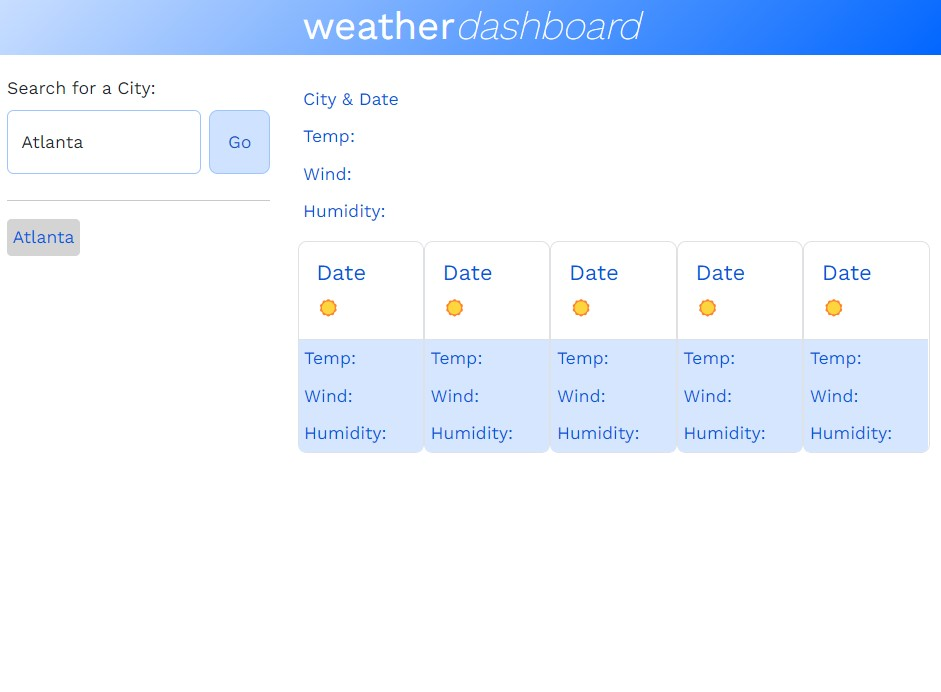

# weather-dashboard

A weather dashboard for viewing the 5-day weather outlook in multiple cities

# Description

For this project, the goal was to create a weather dashboard for users to search the current weather and 5-day forecast in different cities. The cities that the user searches for display in a list by use of local storage so they persist whenever the user reopens the web page. The current weather and 5-day forecast display weather icons.

# Usage

To navigate to the web application in your browser, click [here](https://ndallich1.github.io/weather-dashboard/)

